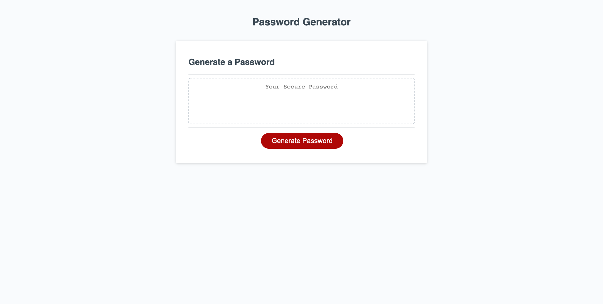

# Password-generator

refract a marketing agency website to use semantic HTML

## Table of contents
- [Overview](#overview)
- [Techonologies](#technologies)
- [Screenshot](#screenshot)
- [Links](#links)
- [My process](#my-process)

## Overview
This week’s Challenge requires you to modify starter code to create an application that enables employees to generate random passwords based on criteria that they’ve selected. This app will run in the browser and will feature dynamically updated HTML and CSS powered by JavaScript code that you write. It will have a clean and polished, responsive user interface that adapts to multiple screen sizes.

## Technologies
- HTML
- CSS
- GitHub Pages
- Javascript
- ...more

## Screenshot

## Links
- github URL: [here](https://github.com/MohamedWarsame04/Password-generator)
- Live Site URL:[here](https://mohamedwarsame04.github.io/Password-generator/)

## My process
Indlude password criteria which are:
- lowercase “abcdefghijklmnopqrstuvwxyz”
- uppercase “ABCDEFGHIJKLMNOPQRSTUVWXYZ”
- numeric “0123456789"
- special characters ” !\“#$%&‘()*+,-./:;<=>?@[]^_`{|}~”

User Journey:
User clicks on button
User will be presented with a prompt to enter length of password (10)
User will be presented with a confirm for lowercase (true)
User will be presented with a confirm for uppercase (true)
User will be presented with a confirm for numeric (true)
User will be presented with a confirm for special characters (true)
User will see the password on the page

Rules
- Password length (len >= 8 < 128)
- From all of the confirms at least one should be true